- [1. Data of sound velocity in different files](#1-data-of-sound-velocity-in-different-files)
  - [1.1. Data in vehicleCTD.txt](#11-data-in-vehiclectdtxt)
  - [1.2. Data in .all file](#12-data-in-all-file)
    - [1.2.1. In XYZ88 datagram](#121-in-xyz88-datagram)
    - [1.2.2. In sound velocity profile datagram](#122-in-sound-velocity-profile-datagram)
  - [1.3. Data in SVP_all.svp](#13-data-in-svp_allsvp)
- [2. What datagrams .all file contains](#2-what-datagrams-all-file-contains)
- [3. Installation parameters](#3-installation-parameters)
- [4. Reconstruct the mesh](#4-reconstruct-the-mesh)
  - [4.1. Use constant sound velocity](#41-use-constant-sound-velocity)
  - [4.2. Use raw range and angle data](#42-use-raw-range-and-angle-data)
    - [4.2.1. Data process](#421-data-process)
    - [4.2.2. Reconstruct result and comparison](#422-reconstruct-result-and-comparison)

# 1. Data of sound velocity in different files
## 1.1. Data in vehicleCTD.txt
(e.g., from *Mission_58_20190618_6/* ) 
- <a name="CTDplot"></a> vehicleCTD.txt (depth v.s. sound speed)
- The interval quite fits the sound velocity in stored in multi beams. *The plot Python script can be found at ```sound_velocity.py -> plot_raw_vehicleCTD_sound_speed()```.*
  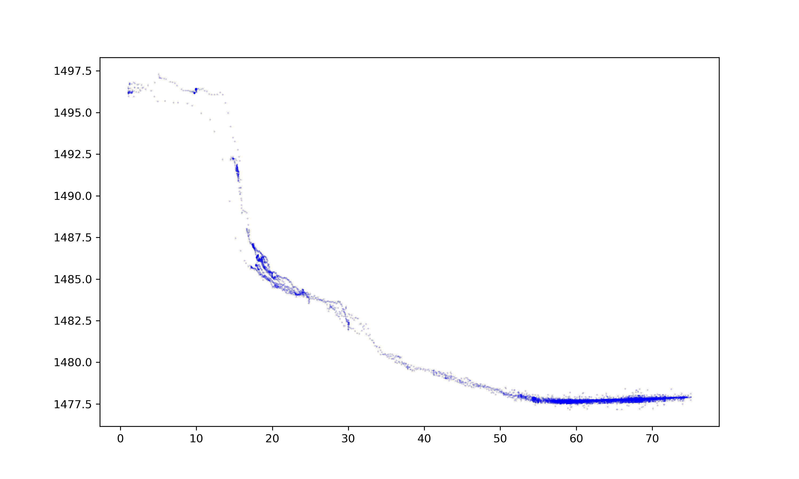
  
- Do linear regression y = ax +b for vehicleCTD.txt file
    1. choose the transducer depth ~[55.147987365722656,    77] m where the auv is
    2. use y = ax+b to fit raw data, get (a, b) = ([1.    29864668e-02 1.47689697e+03]). In this range, data is almost constant.
    3. use (a, b) to interpolate all transducer depth

## 1.2. Data in .all file
(e.g., from *Mission_58_20190618_6/EM2040-0012-l02s01-20190618-174142.all* ) 
  ### 1.2.1. In XYZ88 datagram
  - use two kinds of depth to look: 
    1. transducer depth ~[56.147987365722656, 75.08687591552734] m, distance from the sea level to auv.
    2.  sea floor underneath (calculate the z when y = 0 to get the distance between the auv and sea floor, add it with transducer depth to get total distance). *The plot Python script can be found at ```sound_velocity.py -> plot_soundSpeed_vs_depth()```.*
      
  - Note that for other .all file, Mission_58_20190618_6/EM2040-0013... & Mission_58_20190618_6/EM2040-0014.... The sound velocity looks in the same interval.
  - The sound velocities saved in XYZ88 datagram are discrete values, and they are almost constant of 1477.7 m/s (unit is dm/s in the figure).

    

  ### 1.2.2. In sound velocity profile datagram
  - In the same file, instead of the multibeam data, there is a datagram of the sound velocity profile. The depth and sound speed values of it show below. *The plot Python script can be found at ```sound_velocity.py -> plot_sound_velocity_profile()```.*
    ​	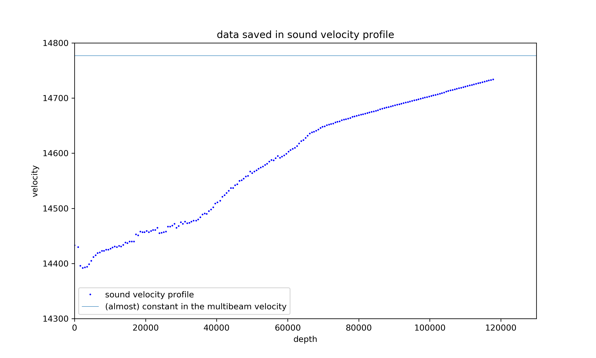

## 1.3. Data in SVP_all.svp
  - SVP_all.svp is generated by an online software mb-system. It uses depth and sound velocity in original multibeam data to recalculate and correct the sound velocity. We are not sure about how it is corrected.
  - depth vs sound vehicle in SVP_all.svp. *The plot Python script can be found at ```sound_velocity.py -> plot_soundSpeed_vs_depth()```.*
    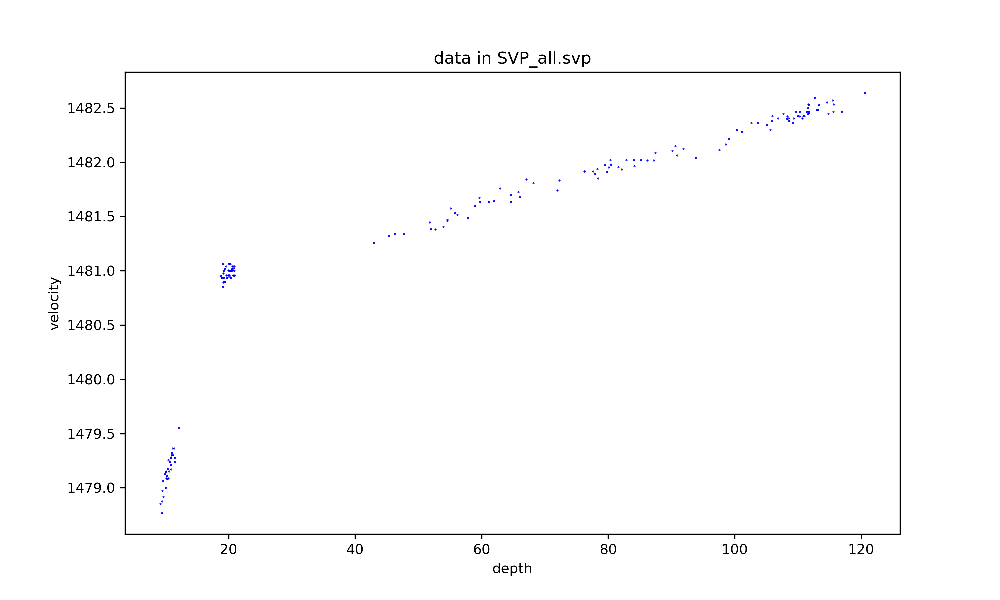
    
  - It shows that after mb-system correction, in the same depth interval ~[55, 75]m，corrected sound velocity is much higher >1481 m/s, based on origial data in about 1477 m/s.
  - Linear fit to SVP_all.svp in auv depth interval ~[55, 80]. y = a*x +b. [a, b] = [1.71773480e-02, 1.48058942e+03].
  
    


# 2. What datagrams .all file contains

```
In the file EM2040-0012-l02s01-20190618-174142.all, 
(note that all the non-start all file contain these 10 datagrams)
Got 424 of type 49 with hex 0x31            pu status update
Got 419 of type 65 with hex 0x41            all_nav_attitude - attitude
Got 1 of type 73 with hex 0x49              multi-beam. installation parameter start (table 45)
Got 4806 of type 78 with hex 0x4e           raw range and angle 78
Got 2118 of type 80 with hex 0x50           all_nav_entry - Position. table 39
Got 213 of type 82 with hex 0x52            runtime parameters (Table 46)
Got 1 of type 85 with hex 0x55              sound speed profile (Table 43)
Got 4806 of type 88 with hex 0x5888.          all_mbes_ping - XYZ 88
Got 4806 of type 89 with hex 0x59           seabed image data 89 (Table 31)
Got 1 of type 105 with hex 0x69             multi-beam. installation parameter stop (table 45)
---------------------------------------------------------------------------------------------------
In the file EM2040-0000-start-20190618-162837.all,
Got 21 of type 48 with hex 0x30                 pu id output
Got 1 of type 66 with hex 0x42                  pu bist (build in self test) result output
Got 1 of type 73 with hex 0x49                  'same...'
Got 3 of type 82 with hex 0x52                  'same...'
Got 1 of type 85 with hex 0x55                  'same...'
Got 1 of type 105 with hex 0x69                 'same...'
---------------------------------------------------------------------------------------------------
In the file  EM2040-0001-start-20190618-162857.all, 
Got 898 of type 49 with hex 0x31                pu status output
Got 885 of type 65 with hex 0x41                all_nav_attitude - attitude
Got 1 of type 73 with hex 0x49                  'same...'
Got 4490 of type 80 with hex 0x50               all_nav_entry - Position   
Got 452 of type 82 with hex 0x52                'same...'
Got 1 of type 85 with hex 0x55                  'same...'
Got 1 of type 105 with hex 0x69                 'same...'
---------------------------------------------------------------------------------------------------
In the file EM2040-0002-start-20190618-164357.all,
content similar to "EM2040-0001-start-20190618-162857.all"
---------------------------------------------------------------------------------------------------
In the file EM2040-0003-start-20190618-165830.all，
content similar to "EM2040-0012-l02s01-20190618-174142.all" (first section). There are also 10 datagrams
---------------------------------------------------------------------------------------------------
```


# 3. Installation parameters
(e.g., from *Mission_58_20190618_6/EM2040-0012-l02s01-20190618-174142.all* ) 

- Using *auvlib::all_installation_param*, all acsii parameters are gained below,
  ```
  WLZ=0.000,SMH=52013,STC=0,S1X=3.809,S1Y=-0.004,S1Z=0.361,S1H=0.100S1P=0.400,S1R=0.150,S1S=1,S2X=3.520,S2Y=-0.004,S2Z=0.330,S2H=0.100S2P=0.400,S2R=0.150,S2S=1,GO1=0.00,TXS=280,R1S=140,TSV=1.07   Mar  82018 ,RSV=1.02   Nov 12 2012 ,BSV=1.11 15.01.22 ,PSV=2.2.2 161215DSV=3.1.8 141125,DDS=4.60 140106,OSV=UNKNOWN,DSX=0.000,DSY=0.000DSZ=0.000,DSD=0,DSO=0.000000,DSF=1.000000,DSH=IN,ROV=1,P1M=0,P1T=0P1Q=1,P1X=0.000,P1Y=0.000,P1Z=0.000,P1D=0.000,P1G=WGS84,P2M=0,P2T=0P2Q=1,P2X=0.000,P2Y=0.000,P2Z=0.000,P2D=0.000,P2G=WGS84,P3M=1,P3T=0P3Q=1,P3X=0.000,P3Y=0.000,P3Z=0.000,P3D=0.000,P3G=WGS_84,P3S=1,MSX=0000,MSY=0.000,MSZ=0.000,MRP=RP,MSD=0,MSR=0.000,MSP=0.000,MSG=0.000NSX=0.000,NSY=0.000,NSZ=0.000,NRP=RP,NSD=0,NSR=0.000,NSP=0.000,NSG=0000,MAS=1.000,GCG=0.000,APS=2,AHS=2,ARO=2,AHE=2,CLS=3,CLO=0,PPS=-1VSN=1,VSE=0,VSU=3001,VTE=0,VTU=5602,VSI=192.168.0.1,VSM=255.255.0.0,
  ```
- One of the interesting findings is that ```S2X=3.520,S2Y=-0.004,S2Z=0.330```. Since in the raw range and data, the RX transducer recalculated projected beam points have about 3.x meter offset with xyz88 data in x direction. It is found that it is due to S2X. There are 3.520 meter offset distance between the auv origin and transducer, where previously transducer was thought as the origin.
- S1X=3.809,S1Y=-0.004,S1Z=0.361

# 4. Reconstruct the mesh
(e.g., from *Mission_58_20190618_6/EM2040-0012-l02s01-20190618-174142.all* )

We tried two ways to reconstruct the mesh to make it closer to the truth and be continuous. The motivation is to solve the make discontinuity of the height of mesh made by different *.all* file data.
  - e.g. the mesh of three .all file data, where show below three lines, and there are valleys in overlapping areas.
   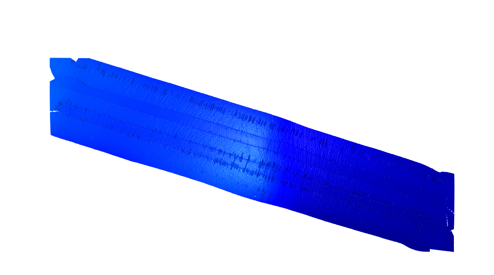

## 4.1. Use constant sound velocity
Since as it shows [In XYZ88 datagram](#in-xyz88-datagram), in this case, the sound velocity is almost constant in the range of traveling depth. It is reasonable to assume the sound velocity is constant and use the value to rebuild the mesh. Note here we consider the offset of the sensor position. Finally, we use auvlib.benchmark to give a score to show how good the mesh is. We expect to get the lowest score at a reasonable sound velocity.


- Consistency error is likely linearized with the sound speed in the valid range [1430, 1550] m/s. The optimal sound velocity for minimum loss in a large range is ~ 1230 m/s, which is not a reasonable value. It shows the consistency error calculated by *auvlib.benchmark* cannot be used as a measurement in this case.
  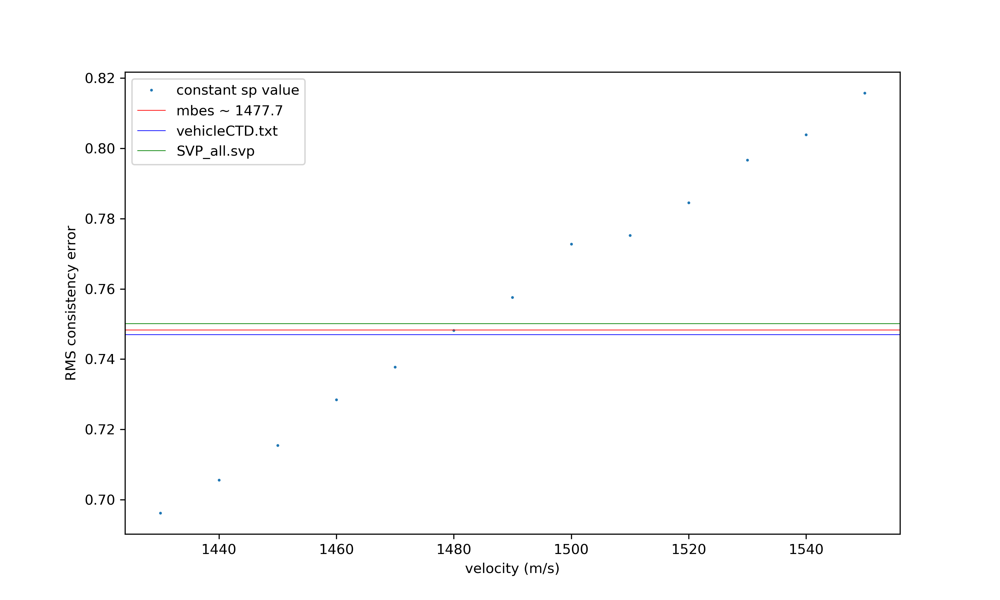
  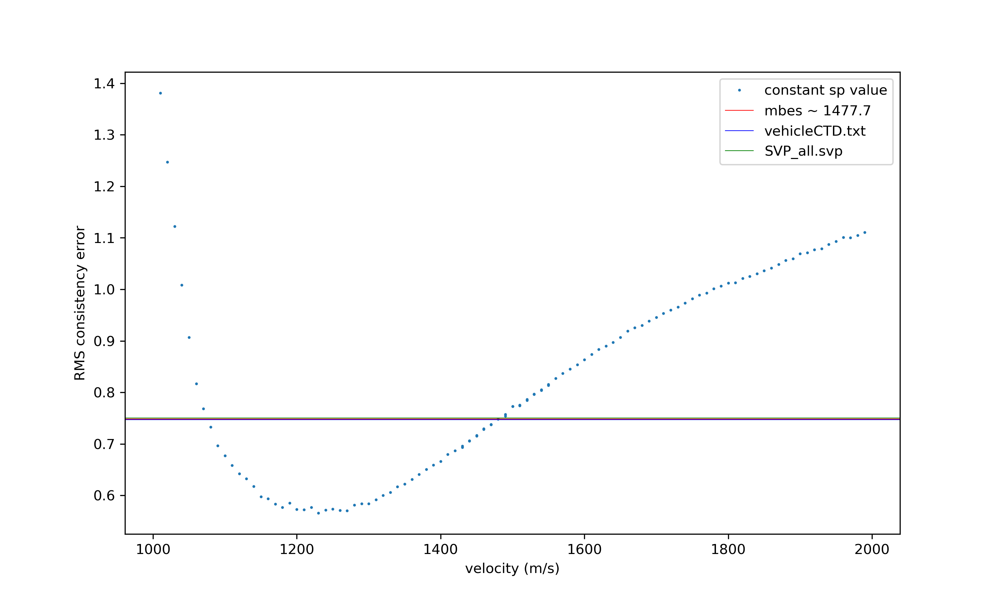
- The following figure shows how the height map & overlapping area of the three lines(files) look like at the sound velocity of 1230 m/s (optimum calculated by the *auvlib.benchmark*), and 1480 m/s(close to the original sound velocity).
  - 1230 m/s
  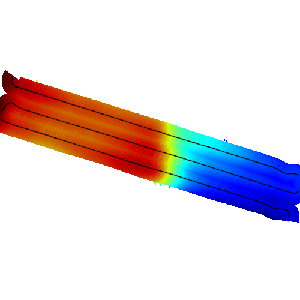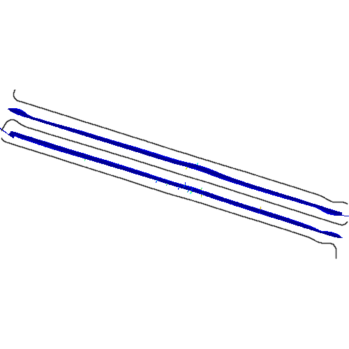
  - 1480 m/s
  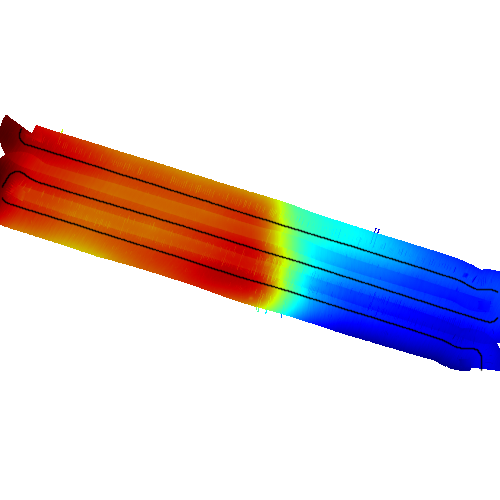
  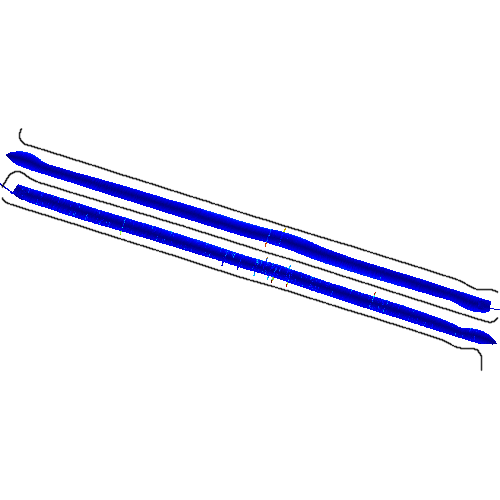


## 4.2. Use raw range and angle data
### 4.2.1. Data process
- the sound speed for all pings. *The plot Python script can be found at ```sound_velocity.py -> plot_raw_range_and_beam_angle()```.*
  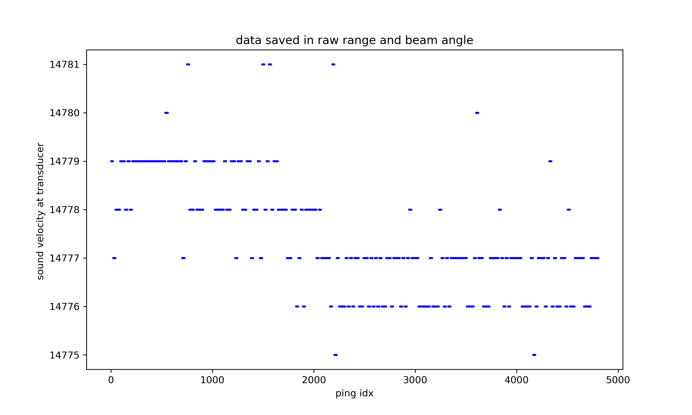

- Figure below shows the two-way traveling time for all the beams in the first ping for an instant. The upper one is travel time v.s. beam idx. The lower one is the travel time v.s. beam pointing angle.

  ![raw range and beam angle[0] - two way travel time with transmit EM2040-0012-l02s01-20190618-174142](figures/two_way_travel_time_with_transmit.png)


- Details of calculating the raw range and angle to xyz88.
  - according to the beam angle, sound velocity, and traveling time, calculate the (x, y, z) as ```all_mbes_ping::PingsT ```. Note that to keep the property of ```all_mbes_ping::PingsT ``` consistent - already considered roll and pitch, here we apply roll and pitch info from attitude datagram as well.
    ```
    all_mbes_ping::PingsT raw_range_and_beam_angle_convert_to_pings (all_raw_range_and_beam_angle::EntriesT & raws,  all_nav_attitude::EntriesT& attitude_entries);
    ```
  - add the missing info transducer depth & heading to it from ```all_nav_entry::EntriesT```.
    ```
    all_mbes_ping::PingsT   raw_pings_add_transducer_depth_and_heading_to_pings (all_mbes_ping::PingsT & raw_pings, all_nav_entry::EntriesT&   entries);
    ```
  - convert to the global position by adding AUV position lat/long to the local one.
    ```
    std_data::mbes_ping::PingsT raw_convert_matched_entries (all_mbes_ping::PingsT& pings, all_nav_entry::EntriesT& entries);
    ```
  - note that, in above three functions, all of them has coordinate of x -> forward, y -> right, z -> down.

### 4.2.2. Reconstruct result and comparison
Following figures are created by ```read_sound_velocity.py -> plot_raw_mesh_file()```. More details please see the Python code.
- Height map of one all file, eg from *Mission_58_20190618_6/EM2040-0012-l02s01-20190618-174142.all*. *The plot Python script can be found at ```sound_velocity.py -> plot_raw_mesh_file_of_one_file()```.*
  - original from XYZ88 data
    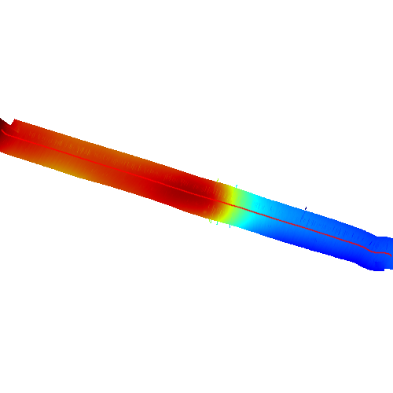 
  - reconstruct from raw range and angle data
    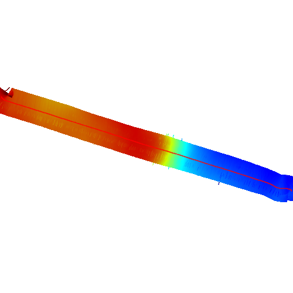

- Height map & mesh of adding three all files together. *The plot Python script can be found at ```sound_velocity.py -> plot_raw_mesh_file_of_all_files_in_the_folder()```.*
  - original from XYZ88 data
    
    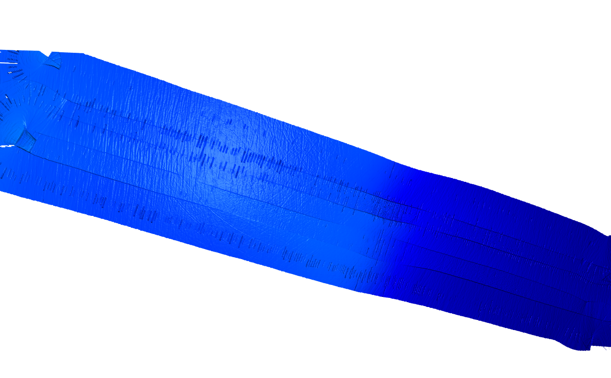
  - reconstruct from raw range and angle data
    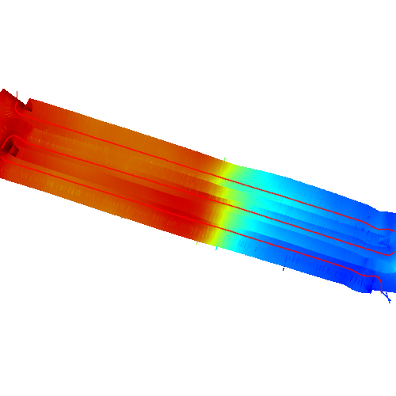
    

